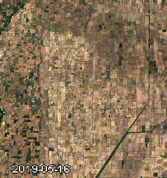
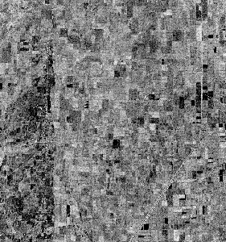

# CC-cropclass
Cloud Computing project for crop classification over Missouri

## Background
Crop classification and the detection of crop phenological cycles is one of the many possibilities of satellite remote sensing for agricultural areas. The reflectence of different spectra changes over the course of the year, revealing information about plant growth stages and thus characteristics of different plant types, which can be used for crop classification.

## Methods
Reference datasets like the USDA NASS Cropland Data Layers allow for demarcating 50 cotton and non-cotton fields over the United States, one of the top ten cotton producing countries (Wang et al., 2021). The area of interest was selected to be in Missouri oriented at Wang et al. who extracted cottonfield reflectance from optical data (2021).
The ESA WorldCover landcover classification was used to mask non-crop areas. The site contained cotton and other agricultural fields in varying ratios. Within Google Earth Engine, the USDA NASS Cropland Data Layers product was used to identify crop types in 2019. This area contains cotton as well as other agricultural fields, with the total area of cotton fields staying relatively constant since 2001. A simple trend analysis revealed a decrease by 1.8 km^2 over the 1038.67 km^2 area of interest.

The NDVI and BSI were added to Sentinel-2 optical imagery as they are indicators for plant health and bare soil exposure which are important factors in the annual run of an agricultural field. As radar backscatter intensity has shown to be influenced by croptype and the phenological cycle (charts generated by the script), one classification was done including Sentinel-1 data for both VV and VH polarization. A comparison of the two classifications showed if inlcuding radar backscatter intensity in cotton classification is feasable.

#### Sentinel-2 time series 2019 over the area of interest:

#### Sentinel-1 VH time series 2019 over the area of interest:

## Results and discussion
Overall validation accuracy of the classifier that did not include Sentinel-1 data was slightly better (0.86) than that of the classifier that included the microwave data (0.85), indicating that inlcuding radar backscatter intensity in cotton classification may not be helpful, keeping in mind that computation requirements increase when more data is added to the classification.
