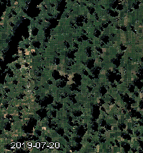

# CC-cropclass
Cloud Computing project for crop classification over Missouri

## Background
Crop classification and the detection of crop phenological cycles is one of the many possibilities of satellite remote sensing for agricultural areas. The reflectence of different spectra changes over the course of the year, revealing information about plant growth stages and thus characteristics of different plant types. These can then be used for crop classification.

## Methods
As cotton is one of the main cash crops in the world, supplying about 79% of global 23 natural fibers (Xun et al., 2021; Wang et al. 2021), an 
Reference datasets like the USDA NASS Cropland Data Layers allow for demarcating 50 cotton and non-cotton fields over the United States, one of the top ten cotton producing 51 countries [2]. Two sampling sites within each of California, Missouri and Georgia were 52 selected oriented at Wang et al. who extracted cottonfield reflectance from optical data 53 [2]. Around the sampling centroids a 2000 m buffer was set to limit the sampling area. 54
The ESA WorldCover landcover classification was used to mask non-crop areas. The 55 sites contained cotton and other agricultural fields in varying ratios, with exact values and 56 sampling locations specified in Table 1 and Figure 2.

Within Google Earth Engine, the xy product was used to identify crop types in 2019 in a small area of interest intersecting Missouri, United States. This area contains cotton as well as other agricultural fields, with the total area of cotton fields staying relatively constant since 2001. A simple trend analysis revealed a decrease by 1.8 km^2 over the 1038.67 km^2 area of interest.

Sentinel-2 time series 2019 over the area of interest:

Sentinel-1 VH time series 2019 over the area of interest:

The NDVI and BSI were furthermore added to the Sentinel-2 image collection as they are indicators for plant fealth and bare soil exposure which are important factors in the annual run of an agricultural field.
As radar backscatter intensity has shown to be influenced by croptype and the phenological cycle (charts generated by the script), one classification was done including Sentinel-1 data for both VV and VH polarization. 

## Results
Overall validation accuracy of the classifier that did not include Sentinel-1 data was slightly better (0.86) than that of the classifier that included the microwave data (0.84).
